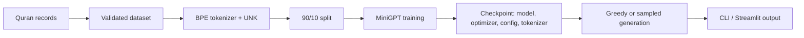

# MiniGPT

MiniGPT is a compact decoder-only Transformer trained from scratch on the supplied Quran corpus. It demonstrates validated data loading, BPE-style tokenization, next-token prediction, reproducible training, checkpointing, and controllable text generation. It is an educational statistical model, not religious guidance or a production-scale LLM.

## Quick Start

```powershell
py -3.12 -m venv .venv
.\.venv\Scripts\Activate.ps1
python -m pip install -r requirements.txt
python -m training.train --config tiny --steps 5 --seed 1337
python -m inference.generate "In the name of Allah" --checkpoint experiments\tiny-<run>\checkpoints\best_model.pt --tokens 40 --temperature 0.8 --top-k 40 --top-p 0.95 --seed 1337
streamlit run app/streamlit_app.py
```

Replace `<run>` with the experiment directory printed by training.

## Architecture



The dataset uses `SURAH_NUMBER|AYAH_NUMBER|TEXT`; validation rejects invalid values, duplicate keys, and malformed Juz structure. Tokenization learns frequent adjacent symbols and persists merges and vocabulary. Training predicts the next token with causal self-attention, cross-entropy loss, and reported perplexity. Warmup and cosine decay control the learning rate. Validation loss selects `best_model.pt`; regular checkpoints support resume.

Generation supports greedy decoding or `torch.multinomial` sampling with temperature, top-k, and top-p. Lower temperature is more conservative; top-k limits candidate count; top-p limits cumulative probability.

## Installation and usage

```powershell
python -m training.train --config tiny --steps 2000 --seed 1337
python -m training.train --config small --steps 2000 --seed 1337
python -m training.train --config medium --steps 2000 --seed 1337
python -m training.train --resume <checkpoint> --steps 500 --seed 1337
python -m inference.generate "In the name of Allah" --checkpoint <checkpoint> --tokens 100 --greedy
python -m inference.generate "In the name of Allah" --checkpoint <checkpoint> --tokens 100 --temperature 0.8 --top-k 40 --top-p 0.95 --seed 1337
streamlit run app/streamlit_app.py
```

Python 3.12 is the verified environment. The Streamlit app starts from the project root and lists checkpoints in `checkpoints/`.

## Verified Experiments

`experiments/configs.json` defines tiny, small, and medium presets. Each run is isolated under `experiments/<config>-<timestamp>/` and contains `config.json`, `history.json`, `metrics.json`, `checkpoint_metadata.json`, `loss.png`, and a `checkpoints/` directory with regular and best checkpoints. Seeds, configuration, dataset, and command identify a reproducible run.

All three verified runs used 2,000 training steps, seed `1337`, and the same Quran dataset and pipeline. These are measured runs, not claims of general language-model quality.

| Config | Parameters | Training time | Final train loss | Final validation loss |
|---|---:|---:|---:|---:|
| Tiny | 137,024 | 151.02 s | 6.14386510848999 | 5.820470895767212 |
| Small | 875,392 | 1,198.47 s | 5.205585479736328 | 5.081963634490966 |
| Medium | 2,792,640 | 3,633.01 s | 4.72406005859375 | 4.484940271377564 |

Scaling increases capacity and improves validation loss, but costs substantially more CPU time: Small is about eight times slower than Tiny, and Medium about three times slower than Small in these runs.

### Generation Example

Using the Medium run's `checkpoints/best_model.pt` with prompt `In the name of Allah`, temperature `0.8`, top-k `40`, top-p `0.9`, seed `1337`:

```text
In the name of Allah will ast of Anerverves, as you who made his led, and the rived the grivobaradmed for is forgivence
```

Greedy generation was also tested against the same checkpoint. These outputs demonstrate learned linguistic patterns, but contain malformed and repetitive text and must not be treated as accurate Quranic text.

## Testing

```powershell
python -m pip install pytest
pytest -q
```

The current suite has 5 tests covering tokenizer round-trip/`<UNK>`, dataset validation, checkpoint save/load, sampling filters, configuration loading, and experiment isolation. Verified result: **5 passed** (with a non-fatal Windows pytest cache warning).

## Project structure

`data/` contains the corpus, Juz mapping, and parser; `model/` contains configuration and the unchanged Transformer; `tokenizer/` contains BPE-style persistence; `training/` contains training and checkpoint orchestration; `inference/` contains CLI generation; `app/` contains Streamlit; `experiments/` contains presets and run artifacts; `tests/` contains automated checks; `evaluation/` contains evaluation utilities.

See [docs/ARCHITECTURE.md](docs/ARCHITECTURE.md), [docs/TRAINING.md](docs/TRAINING.md), [docs/EXPERIMENTS.md](docs/EXPERIMENTS.md), [docs/TROUBLESHOOTING.md](docs/TROUBLESHOOTING.md), and [docs/DEVELOPMENT.md](docs/DEVELOPMENT.md).

## Portfolio summary

**MiniGPT — Quran-corpus decoder-only language model**

- Built a PyTorch language-model pipeline from validated Quran records through tokenization, next-token training, checkpointing, and inference.
- Added seeded tiny/small/medium experiments, warmup/decay scheduling, validation metrics, resume support, and best-model selection.
- Implemented greedy, temperature, top-k, and top-p decoding with CLI and Streamlit interfaces.
- Produced per-run histories, metrics, checkpoints, and loss plots; verified 5 automated tests and 20-step smoke runs.

Technologies: Python, PyTorch, Streamlit, matplotlib, pytest.

Limitations include a small domain-specific corpus, small models, CPU training cost, and no large-scale pretraining or state-of-the-art claims.
