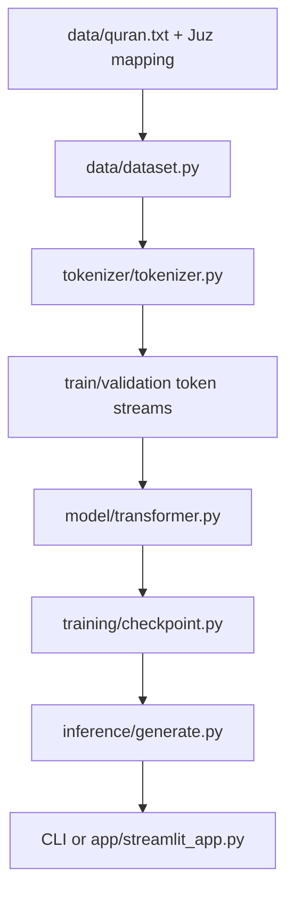

# Architecture

The loader converts records into validated `Ayah` objects and Juz ranges. The tokenizer learns frequent adjacent symbols and maps them to IDs, including `<UNK>`. The trainer samples fixed-length blocks and asks the model to predict the next ID at every position. MiniGPT adds token and positional embeddings, pre-layer-normalized residual blocks, causal self-attention, an MLP, and a tied language-model head. Checkpoints preserve model, optimizer, config, tokenizer, step, and metrics. Inference loads the same state and decodes greedily or probabilistically.
